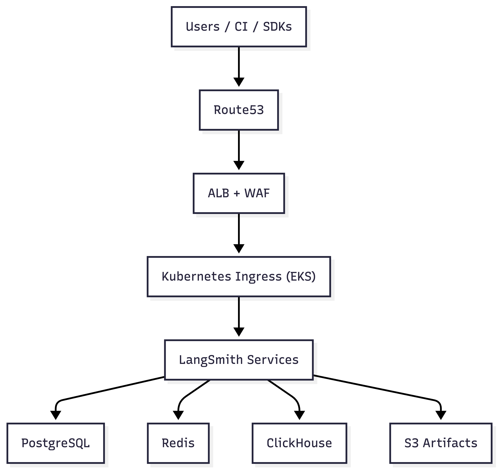

# LangSmith Self-Hosted on AWS — Reference Architecture (P0)

**Status:** P0 Enablement Baseline  
**Audience:** Platform / Infra / MLOps Engineers  
**Goal:** Provide a single, opinionated, supportable path to deploying and operating LangSmith Self-Hosted (SH) on AWS with minimal support intervention.

This document defines the **AWS reference architecture LangChain Enablement stands behind**.  
Alternative approaches may work, but are **out of scope for P0 enablement and future certification**.

---

## Table of Contents

### Getting Started

| What to Do | When to Do It | Where to Find Details |
|------------|---------------|----------------------|
| **Review architecture overview** | Before starting deployment | [Section 1-3](#1-what-this-architecture-is-and-is-not) — Understand what this architecture is, deployment mode, and high-level design |
| **Complete preflight checklist** | **Before any infrastructure work** | [`PREFLIGHT.md`](./PREFLIGHT.md) — Verify prerequisites, permissions, and capacity |
| **Follow deployment walkthrough** | After preflight passes | [`WALKTHROUGH.md`](./WALKTHROUGH.md) — Step-by-step deployment instructions |

### Architecture Reference

| What to Do | When to Do It | Where to Find Details |
|------------|---------------|----------------------|
| **Plan network topology** | During infrastructure design | [Section 4: Network & Ingress](#4-network--ingress) — VPC, subnets, ALB, and ingress requirements |
| **Size compute resources** | During infrastructure design | [Section 5: Compute (EKS)](#5-compute-kubernetes-eks) — EKS cluster and node group sizing |
| **Design data store architecture** | During infrastructure design | [Section 6: Data Stores](#6-data-stores) — PostgreSQL, Redis, and ClickHouse requirements |
| **Review production requirements** | Before production deployment | [`PROD_CHECKLIST.md`](./PROD_CHECKLIST.md) — Detailed production capacity, topology, and scaling guidance |
| **Configure object storage** | During infrastructure setup | [Section 7: Object Storage](#7-object-storage) — S3 bucket and access patterns |
| **Plan secrets and authentication** | During infrastructure setup | [Section 8: Secrets & Identity](#8-secrets--identity) — Secrets management and auth patterns |

### Operations & Troubleshooting

| What to Do | When to Do It | Where to Find Details |
|------------|---------------|----------------------|
| **Understand operational patterns** | After deployment | [Section 8.5: Operational Guidance](#85-operational-guidance) — Ingestion configuration and failure modes |
| **Set up observability** | During/after deployment | [Section 9: Observability](#9-observability-platform-level) — Logging and monitoring requirements |
| **Review security baseline** | Before production | [Section 10: Security Baseline](#10-security-baseline-non-negotiable) — Required security controls |
| **Troubleshoot issues** | When problems occur | [`TROUBLESHOOTING.md`](./TROUBLESHOOTING.md) — Common issues and diagnostic steps |

### Reference Information

| What to Do | When to Do It | Where to Find Details |
|------------|---------------|----------------------|
| **Understand what's excluded** | Before customizing | [Section 11: What's Excluded](#11-what-this-architecture-explicitly-excludes) — Out-of-scope features |
| **Review design rationale** | For context | [Section 12: Why This Exists](#12-why-this-exists) — Purpose and goals of this architecture |

---

## 1. What This Architecture Is (and Is Not)

### This *is*:
- A production-capable **baseline deployment**
- Opinionated by design
- Built on **AWS + EKS + Terraform + Helm**
- Designed to surface real operator responsibilities early
- The foundation for future labs and certification

### This is *not*:
- A performance benchmark
- A multi-region or HA architecture
- A guide for custom service meshes or bespoke gateways
- A promise of security guarantees

---

## 2. Deployment Mode

**P0 Default: Full Self-Hosted**

- Control plane and data plane both run in the customer AWS account
- Customer is responsible for:
  - Network exposure
  - Authentication
  - Data persistence
  - Upgrades and backups

> Hybrid (SaaS control plane + SH data plane) is valid but **out of scope for P0 enablement**.

---

## 3. High-Level Architecture

Request flow (top to bottom):

Users / CI / SDKs  
→ Route53  
→ Application Load Balancer (ALB) + WAF  
→ Kubernetes Ingress (EKS)  
→ LangSmith application services  

Persistent dependencies:

- PostgreSQL — metadata (projects, orgs, users)
- Redis — cache and job queues
- ClickHouse — traces and analytics
- S3 — large artifacts and payload storage (required for production)

**Flow Summary**
- Traffic enters via **Route53 → ALB** (with optional WAF).
- ALB forwards to **Kubernetes ingress** inside EKS.
- LangSmith application services run in EKS.
- Persistent state is handled by:
  - **PostgreSQL** (metadata)
  - **Redis** (cache / queues)
  - **ClickHouse** (traces & analytics)
  - **S3** (large artifacts and payloads; required for production)

This diagram represents the **minimum supported topology** for the P0 reference architecture.

---

## 4. Network & Ingress

### VPC
- Single VPC
- **Public subnets**: ALB only
- **Private subnets**:
  - EKS worker nodes
  - Data services (RDS, Redis, ClickHouse if in-cluster)

### Ingress
- **Application Load Balancer (ALB)**
- **AWS WAF strongly recommended**
- TLS termination at ALB (end-to-end TLS recommended)
- Optionally:
  - Internal ALB + VPN / PrivateLink for non-public access

### Egress
- Outbound HTTPS access to required LangChain endpoints (if applicable)
- Restrict egress access per organizational policy requirements

---

## 5. Compute: Kubernetes (EKS)

### Cluster
- **Amazon EKS**
- Managed node groups
- Cluster Autoscaler enabled
- Metrics Server enabled

### Baseline Capacity
- Minimum cluster capacity:
  - **16 vCPU / 64 GB RAM** available
- This includes LangSmith services + system overhead

> **For detailed production capacity requirements, see [`PROD_CHECKLIST.md`](./PROD_CHECKLIST.md).**

### Storage Requirements (Production)
- **AWS EBS CSI Driver** must be installed for ClickHouse persistence
- **Default EBS-backed StorageClass** must exist and be functional
- ClickHouse requires dynamic PersistentVolume provisioning via EBS CSI

### Autoscaling
- **HPA (Horizontal Pod Autoscaler) is required** for LangSmith services
- **KEDA is optional** (P1 / advanced autoscaling) and not part of the P0 baseline
- If KEDA is used, ensure proper interaction with HPA and document triggers

---

## 6. Data Stores

LangSmith SH relies on three core data stores.

### PostgreSQL (Metadata)
- **AWS RDS PostgreSQL or Aurora PostgreSQL**
- PostgreSQL **14+**
- Single AZ for P0 (HA is P1)
- Automated backups enabled

### Redis (Cache / Queues)
- **AWS ElastiCache (Redis OSS)**
- Single node acceptable for P0
- Persistence optional but recommended

## ClickHouse (Traces & Analytics)

ClickHouse is **memory-, I/O-, and concurrency-intensive**. Proper sizing and topology are mandatory for production stability.

> **For detailed production requirements, see [`PROD_CHECKLIST.md`](./PROD_CHECKLIST.md#3-clickhouse-traces--analytics-required).**

### Production Requirements (P0 – Baseline)

**Topology**
- **Production requires a replicated ClickHouse cluster**
- **Baseline: 3 ClickHouse replicas** (minimum for production)
- Single-node ClickHouse is **not supported for production workloads**
- Read and write concurrency must be able to scale independently
- **Guardrail:** Clusters typically should remain ≤5 replicas

**Compute**
- 8 vCPU
- 32 GB RAM

**Storage**
- SSD-backed persistent storage
- ~7000 IOPS
- ~1000 MiB/s throughput

> ⚠️ **Query concurrency and disk I/O are leading indicators**, not CPU/memory. Monitor these metrics to identify bottlenecks before they impact system health.

---

### Suitable for Dev-Only

- 4 vCPU / 16 GB RAM
- Single ClickHouse node
- **Non-production proof-of-concept only**

---

### Blob Storage (Required for Production)

**Blob storage (S3) is REQUIRED for production deployments.** Without blob storage, large trace payloads stored inline in ClickHouse increase part counts, merge pressure, and read amplification, leading to concurrency collapse, delayed trace visibility, and missing traces under load.

> **For complete blob storage requirements, see [`PROD_CHECKLIST.md`](./PROD_CHECKLIST.md#4-blob-storage-required-for-production).**

#### Non-Production Guidance
Blob storage may be omitted **only** in dev/eval environments that are:
- Low-traffic (minimal trace volume)
- Short-lived (proof-of-concept or temporary)
- Not subject to production SLAs

For any deployment expected to handle real workloads or persist beyond evaluation, blob storage is required.

---

### Scaling Guidance (P1)

**ClickHouse Scaling**
- Keep existing CPU/RAM sizing (8 vCPU / 32 GB RAM baseline, scale to 16 vCPU / 64 GB RAM as needed)
- **Query concurrency and disk I/O are leading indicators**, not CPU/memory
- Scale ClickHouse to **16 vCPU / 64 GB RAM** and/or additional replicas when:
  - Trace ingestion volume grows
  - Concurrent query count increases
  - Query latency trends upward
  - Insert lag begins to drift

> ⚠️ **Scaling ClickHouse without blob storage has diminishing returns** at higher write and concurrency levels.

**Redis Sizing**
- For high-write workloads, ensure Redis has sufficient memory and network bandwidth
- Monitor Redis memory usage, connection counts, and queue depths
- External Redis (AWS ElastiCache) is required for production workloads with significant write volume
- Single-node Redis is acceptable for P0 baseline, but consider replication for production workloads

---

## 6.5. Read vs Write Path Mental Model

Understanding the separation between read and write paths is critical for effective scaling and troubleshooting.

### Write Path
**Backend → Redis → Queue → ClickHouse**

- Traces are received by the backend service
- Data flows through Redis (caching/queuing)
- Queue workers process and insert into ClickHouse
- This path handles ingestion and write concurrency

### Read Path
**Backend → ClickHouse**

- User queries and trace retrieval go directly from backend to ClickHouse
- This path handles query concurrency and read performance

> ⚠️ **Scaling the wrong layer can worsen outages.** For example, adding queue workers without scaling ClickHouse will increase write pressure on an already saturated database, making the problem worse. Always identify whether the bottleneck is in the write path (queue/workers) or read path (ClickHouse query capacity) before scaling.

---

## 7. Object Storage

### S3 (Required for Production)
- **Blob storage is REQUIRED for production deployments**
- Stores large trace artifacts and payloads
- Reduces ClickHouse part counts and merge pressure
- Prevents delayed or missing traces under load
- Improves security posture for sensitive inputs/outputs

### Access Pattern
- Use **IAM Roles for Service Accounts (IRSA)** where possible
- No static credentials in Helm values

> **For non-production guidance, see [Section 6: Blob Storage](#blob-storage-required-for-production).**

---

## 7.5. Production Requirements Summary

### Core Production Requirements
- **Blob storage (S3) is REQUIRED** for production deployments
- **EBS CSI Driver** must be installed on EKS for ClickHouse persistence
- **Default EBS-backed StorageClass** must exist and be functional
- **HPA (Horizontal Pod Autoscaler) is required** for service autoscaling

### Why These Requirements Exist
- **Blob storage**: Reduces ClickHouse merge pressure and part counts, preventing delayed/missing traces under load. Without it, large payloads stored inline cause concurrency collapse.
- **EBS CSI Driver**: Required for dynamic PersistentVolume provisioning on EKS. ClickHouse persistence depends on stable EBS-backed storage; without EBS CSI, PVCs cannot bind and ClickHouse pods will not start.
- **HPA vs KEDA**: HPA is the Kubernetes-native baseline and sufficient for P0. KEDA adds complexity and is optional (P1/advanced); baseline keeps to HPA for simplicity and supportability.

---

## 8. Secrets & Identity

### Secrets
- **AWS Secrets Manager** (preferred)
- Inject into Kubernetes via:
  - External Secrets
  - CSI driver
  - Secure environment injection

### Identity & Auth
- LangSmith authentication must be configured explicitly
- Supported patterns include:
  - Token-based authentication
  - OIDC / SSO (at least one concrete example recommended for enablement)

> For P0 enablement, select **one authentication pattern** to focus on. Additional patterns may be explored in future enablement tracks.

---

## 8.5. Operational Guidance

> **For detailed operational guidance including ingestion configuration and failure modes, see [`PROD_CHECKLIST.md`](./PROD_CHECKLIST.md#8-optional-performance-levers-not-fixes) and [`PROD_CHECKLIST.md`](./PROD_CHECKLIST.md#10-known-failure-mode-awareness).**

### Ingestion Configuration

**CLICKHOUSE_ASYNC_INSERT_WAIT_PCT_FLOAT=0** can be used as an optional ingest lever to reduce write latency. However, **this setting does not fix underlying ClickHouse saturation**. If ClickHouse is saturated, this may mask symptoms temporarily but will not resolve root causes.

### Failure Modes

Common issues often manifest as **"traces created but not visible"** due to ingestion backpressure. This occurs when:

- ClickHouse write capacity is exceeded
- Queue workers cannot keep up with ingestion volume
- ClickHouse merge operations are backlogged
- Disk I/O is saturated

When investigating trace visibility issues, check:
1. ClickHouse query concurrency and disk I/O metrics
2. Queue depth and worker processing rates
3. ClickHouse merge operations and part counts
4. Ingestion delay metrics (`received_at → inserted_at`)

---

## 9. Observability (Platform-Level)

Minimum required:
- Application logs accessible via CloudWatch
- Kubernetes events visible
- Health endpoints monitored

Optional (P1):
- Prometheus / OpenTelemetry exporters
- Alerting on:
  - Pod restarts
  - DB connectivity
  - Ingestion failures

---

## 10. Security Baseline (Non-Negotiable)

This reference architecture requires **essential security controls** as a baseline.

### MUST
- TLS enabled
- No plaintext secrets
- Least-privilege IAM
- Network isolation (private subnets for data services)
- WAF or equivalent rate limiting at ingress

### SHOULD
- Private access only (VPN / PrivateLink)
- Auth required for all UI and API access
- Regular patching and upgrades

### Explicit Disclaimer
> This reference architecture does **not** guarantee security.  
> Customers are responsible for reviewing and approving deployments with their security teams.

---

## 11. What This Architecture Explicitly Excludes

These are **out of scope for P0 enablement**:
- Multi-region active/active
- Custom gateways or service meshes
- HA ClickHouse clusters
- Custom scaling policies beyond autoscaler defaults
- Performance benchmarking beyond sanity checks

These may appear in P1/P2 enablement or certification tracks.

---

## 12. Why This Exists

This reference architecture exists to:
- Reduce installation failures and complexity
- Provide support teams with a shared baseline
- Create a clear, well-documented enablement path
- Serve as the foundation for:
  - Hands-on labs
  - Operator certification
  - Support playbooks

If you encounter challenges during implementation, these often indicate areas where additional attention or configuration is needed, rather than system defects.

---

## 13. Next Artifacts (Planned)

- Preflight checklist
- Deployment walkthrough
- Known sharp edges
- Failure-mode diagnostics
- Operator mental model

These resources build **on top of this foundation**, providing additional guidance and support as you progress.
