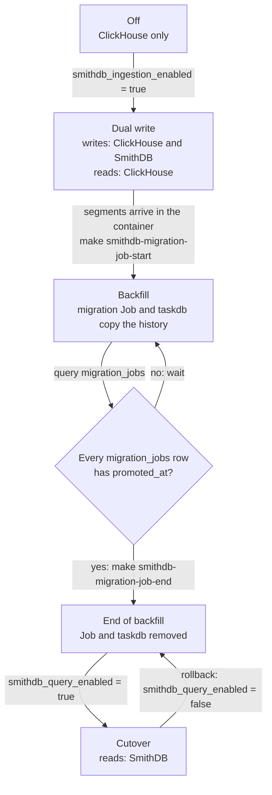

# SmithDB on Azure

SmithDB support on Azure is optional and starts at the LangSmith chart 0.17
line. Set `enable_smithdb = true` to provision its Azure dependencies
independently of the LangSmith application database and trace-blob account.

## Version requirements

Two version numbers apply here, and they are not the same thing.

**LangSmith chart: a stable release on the 0.17 line.**
The 0.17 line is the first with both the Azure SmithDB values and the per-pod
cache PVC contract. `deploy.sh` accepts `0.17.x` only. It rejects 0.16, because
the Azure values are absent there, and it rejects 0.18, because the module pins
a chart line and never crosses a minor on its own.

The default pin, `~0.17.0`, takes the newest released 0.17 patch. Helm leaves
prereleases out of a constraint like that, so it selects only stable releases.
Naming a prerelease exactly does install it, and that is not a supported
configuration: an RC carries an unreleased application image, so a problem found
on one cannot be told apart from a problem in the module.

**Module tag: `v0.17.*`.** SmithDB is an ordinary feature of the pinned line, so
it needs no chart selection of its own. Leave `langsmith_helm_chart_version`
empty to take the newest 0.17 patch, or set it to name one. A `v0.16.*` tag
cannot deploy SmithDB on Azure: its pin is `~0.16.0`, and the 0.16 chart has no
Azure SmithDB values.

## Infrastructure

The Terraform root creates:

- a dedicated private Azure Database for PostgreSQL Flexible Server 18 and an
  empty `smithdb` database;
- a dedicated Blob Storage account and private container. Shared Key stays
  enabled so the chart's optional static-key path
  (`smithdb.config.objectStore.azure.accessKeySecretKey`) remains available.
  The default runtime path does not use it;
- a SmithDB-only user-assigned identity, federated to the chart-owned SmithDB
  Kubernetes ServiceAccount and scoped to `Storage Blob Data Contributor` on
  that account. Set `smithdb_migration_enabled = true` and the identity also
  receives `Storage Blob Data Reader` on the LangSmith trace-blob account, which
  is the source the historical backfill reads. The grant exists only while that
  flag is on, so a steady-state install leaves the identity able to reach
  nothing but its own account; and
- a Premium SSD v2 StorageClass for per-pod cache volumes. SmithDB workloads
  schedule on ordinary AKS nodes by default. The StorageClass is cluster-scoped,
  so its name carries the deployment suffix unless
  `smithdb_cache_storage_class_name` names one.

By default, the same SmithDB workload identity authenticates to PostgreSQL
through Microsoft Entra ID and is configured as the Flexible Server's Entra
administrator. This avoids a static database password and the separate SQL
bootstrap step that a less-privileged Entra principal would require.

To use password authentication instead, supply the password outside committed
tfvars. Because Terraform creates the server, that password is stored in
Terraform state:

```bash
export TF_VAR_smithdb_metastore_admin_password='<strong-random-password>'
terraform -chdir=infra apply
```

The metastore Secret is created in the LangSmith namespace before Helm runs. In
Entra mode it contains only the host, database, and username; the chart sets
`iamAuthProvider: azure`. Object-store access also uses Azure Workload Identity,
so no Storage Account key or SAS token is written to Kubernetes or Terraform
outputs.

Azure RBAC does not take effect the moment the grant is created. A blob
data-plane role change needs up to 10 minutes, and the backfill runs from a
separate Helm pass that an operator can start straight after `terraform apply`
returns. So the apply that creates the `Storage Blob Data Reader` grant waits
300 seconds before it hands control back, in
`time_sleep.smithdb_trace_blob_reader_propagation`. The pause is deliberate. Let
it finish.

The wait shortens this race and does not remove it. A backfill that reads the
source account before the grant is effective fails with 403 responses that look
the same as a missing grant. Confirm the assignment exists with
`az role assignment list`, wait, and retry before you treat the 403 as a defect.

Setting `smithdb_migration_enabled` back to false removes the grant. A backfill
that has to run again needs the flag on again, and waits again.

## Chart contract

The chart 0.17 line supports Azure as a SmithDB object-store provider and
per-pod cache PVCs. `make init-values` generates the overlay from
`smithdb_storage_account_name` and `smithdb_storage_container_name`, annotates
the SmithDB ServiceAccount with `azure.workload.identity/client-id` from
`smithdb_workload_identity_client_id`, and labels SmithDB pods with
`azure.workload.identity/use: "true"`.

`deploy.sh` loads up to four SmithDB files, in this order:

1. `langsmith-values-smithdb-sizing.yaml`, which `init-values.sh` writes from
   the `smithdb_helm_values` output on every run. It holds the chart tier, the
   replicas, and the `minimal` resources. Do not edit it; see [Sizing](#sizing).
2. `langsmith-values-smithdb.yaml`, the overlay. `init-values.sh` copies it once
   and never overwrites it, so scheduling and other hand edits go here.
3. `langsmith-values-smithdb-overrides.yaml`, which `init-values.sh` writes from
   the identity, storage, and metastore outputs on every run.
4. `langsmith-values-smithdb-migration.yaml`, which
   `make smithdb-migration-job-start` writes with the TaskDB source and the
   migration pod count. `deploy.sh` loads it only while
   `smithdb_migration_enabled = true`.
   `helm/values/examples/langsmith-values-smithdb-migration.yaml` shows the
   layout.

A later file wins, so a `smithdb.resourceTier` line in the overlay replaces the
size. An overlay copied before the sizing file existed has that line.
`init-values.sh` warns about it; delete the line.

While `smithdb_migration_enabled = true`, `deploy.sh` stops before Helm runs
when:

- `langsmith-values-smithdb-migration.yaml` is missing. Run
  `make smithdb-migration-job-start`.
- The `parallelism` in that file is not equal to the
  `smithdb_migration_parallelism` of the last `make apply`. Terraform sizes the
  namespace quota from that value.
- The TaskDB Secret is missing a key: `smithdb-taskdb` for a chart-managed
  TaskDB, or `smithdb-taskdb-external` for an external one.

At any stage, `deploy.sh` also stops when the migration gate in
`langsmith-values-smithdb-overrides.yaml` is not equal to
`smithdb_migration_enabled`. Run `make init-values`.

Select the chart line explicitly alongside the flag, as described in
[Version requirements](#version-requirements):

```hcl
enable_smithdb               = true
langsmith_helm_chart_version = "~0.17.0"
```

The chart is intentionally a separate deployment pass: `terraform apply`
provisions the Azure and Kubernetes prerequisites but does not install
LangSmith itself.

The federated identity subject is derived with the same fullname convention as
the chart. For example, release `langsmith` uses `langsmith-smithdb`, while
release `prod` uses `prod-langsmith-smithdb`.

## Sizing

`smithdb_sizing` sets the chart `resourceTier`, the replicas, the `minimal`
resources, the default metastore SKU, and the namespace quota headroom. Set it
in `infra/terraform.tfvars`, then run `make deploy-all`:

```hcl
smithdb_sizing = "small"   # minimal, small, medium, or large
```

When it is unset, it follows `sizing_profile`: `minimum`
gives `minimal`, `dev` and `default` give `small`, `production` gives `medium`,
and `production-large` gives `large`.

The component rows are per replica, as CPU / memory / cache volume:

| | `minimal` | `small` | `medium` | `large` |
|---|---|---|---|---|
| Throughput: ingest / query QPS | development only | 10 / 10 | 100 / 40 | 1000 / 100 |
| Chart `resourceTier` | `small`, explicit resources | `small` | `medium` | `large` |
| Replicas: `query` / `ingestion` / `compactionWorker` | 1 / 1 / 1 | 1 / 1 / 1 | 1 / 1 / 1 | 4 / 2 / 4 |
| `query` | 1 / 2Gi / 200Gi | 4 / 8Gi / 200Gi | 28 / 48Gi / 200Gi | 28 / 50Gi / 1000Gi |
| `ingestion` | 1 / 2Gi / 100Gi | 4 / 8Gi / 100Gi | 16 / 32Gi / 100Gi | 56 / 150Gi / 1000Gi |
| `compactionWorker` | 1 / 2Gi / 100Gi | 8 / 16Gi / 100Gi | 16 / 32Gi / 100Gi | 28 / 50Gi / 300Gi |
| `compaction` | 500m / 1Gi | 2 / 4Gi | 4 / 8Gi | 8 / 16Gi |
| `clusterManager` | 250m / 256Mi | 250m / 256Mi | 250m / 256Mi | 2 / 2Gi |
| Sum at these replicas (pods) | 3.75 / 7.25Gi (5) | 18.25 / 36.25Gi (5) | 64.25 / 120.25Gi (5) | 346 / 718Gi (12) |
| Backfill Job | 1 / 4Gi | 8 / 32Gi | 8 / 32Gi | 8 / 32Gi |
| Cache HPA `maxReplicas` | 1 | 10 (chart default) | 10 (chart default) | 10 (chart default) |
| VM for the largest pod, for example | general pool | 16 vCPU, `Standard_D16s_v5` | 32 vCPU, `Standard_D32s_v5` | 64 vCPU and over 150 GiB, `Standard_D64s_v5` |
| Default metastore SKU (vCPU / memory) | `GP_Standard_D2ds_v5` (2 / 8Gi) | `MO_Standard_E2ds_v5` (2 / 16Gi) | `MO_Standard_E4ds_v5` (4 / 32Gi) | `MO_Standard_E8ds_v5` (8 / 64Gi) |
| Quota headroom: CPU / memory / pods | 5 / 10Gi / 12 | 27 / 53Gi / 12 | 93 / 169Gi / 12 | 402 / 868Gi / 26 |
| Quota headroom with the backfill | 8 / 18Gi / 20 | 37 / 89Gi / 20 | 103 / 205Gi / 20 | 412 / 904Gi / 34 |

- The throughput and replica rows come from the SmithDB sizing table in the
  [LangSmith self-hosted docs](https://docs.langchain.com/langsmith/self-host-smithdb-scale).
  The replicas are the HPA `minReplicas` of the three cache components.
  `compaction` and `clusterManager` have no HPA and run one replica.
- The `small`, `medium`, and `large` component rows and the cache volumes come
  from the chart tier, where requests equal limits. `minimal` runs the `small`
  tier, so it keeps the `small` cache volumes. Its values are requests, and its
  limits are 2x. Use `minimal` only for development and test.
- The metastore defaults match the "Metastore capacity" section of the same
  docs page. A `smithdb_metastore_sku_name` that you set replaces the default,
  also after a size change. A SKU change restarts the Flexible Server.
- The VM row is the smallest shape that holds the largest pod. Set the pool
  `max_count` to cover the sum row at that shape, plus one node for the surge
  copy of the largest pod, plus room for the backfill Job while it runs.
- The quota rows are what Terraform adds to the namespace ResourceQuota: once
  to requests and twice to limits. They cover the replicas above, one surge copy
  of the largest pod, and, in the backfill stage, the Job and the taskdb. HPA
  scale-out above `minReplicas` gets only the surge room, and the quota refuses
  the next pod with a `FailedCreate` event on the ReplicaSet. Read the resolved
  values with `terraform -chdir=infra output smithdb_quota_extra`.
- The backfill quota row is for one migration pod. Each further migration pod
  (`smithdb_migration_parallelism`) adds the backfill Job row and 1 pod. For
  `small`, 3 migration pods give 53 CPU / 153Gi / 22 pods.

A wrapper root that calls this module must declare `smithdb_sizing` and
`smithdb_migration_parallelism` and pass them through. It must also re-export
these outputs, which the scripts read through `LANGSMITH_INFRA_DIR`:

- `smithdb_helm_values`. Without it, `init-values.sh` stops when SmithDB is on.
- `smithdb_sizing`, which `make smithdb-migration-job-start` reads to suggest a
  migration pod count.
- `smithdb_migration_parallelism`, which `deploy.sh` compares with the
  migration values file.

## Staged rollout

Keep ClickHouse enabled in every stage. Set the gates in
`infra/terraform.tfvars`, and apply after each stage. The backfill is the one
stage with its own make targets. They set `smithdb_migration_enabled` for you.

| Stage | How | ingestion / migration / query |
|---|---|---|
| Off | The defaults | false / false / false |
| Dual write | Set `smithdb_ingestion_enabled = true` | true / false / false |
| Backfill | `make smithdb-migration-job-start` | true / true / false |
| End of backfill | `make smithdb-migration-job-end` | true / false / false |
| Cutover | Set `smithdb_query_enabled = true` | true / false / true |



Apply each stage before you start the next one:

- In this repo's root, run `make deploy-all`.
- Under a wrapper root, `make apply` refuses to run, so `make deploy-all` does
  too. Run `terraform apply` in the wrapper root. Then export
  `LANGSMITH_INFRA_DIR` and `LANGSMITH_VALUES_DIR` and run
  `make seed-secrets k8s-secrets init-values deploy`.

1) Dual write. LangSmith writes to ClickHouse and SmithDB, and reads stay on
ClickHouse. Confirm that segments arrive in the SmithDB container.

2) Backfill, to copy the ClickHouse history:

```sh
make smithdb-migration-job-start
make deploy-all
```

`make smithdb-migration-job-start` asks about TaskDB and about the size of the
migration:

- TaskDB is a temporary Postgres that holds the task state. A chart-managed
  TaskDB uses the `smithdb-taskdb` Secret, whose password `make seed-secrets`
  generates in Key Vault and `make k8s-secrets` copies into the namespace. The
  password never enters Terraform state. Never rotate it: a taskdb that already
  initialized keeps the old one. An external TaskDB is a Postgres that you
  supply. The script writes its connection settings to the
  `smithdb-taskdb-external` Secret. Do not use the LangSmith Postgres or the
  SmithDB metastore.
- For the size, the script asks for the number of historical runs and the
  target days. It suggests a migration pod count from the docs formula (runs /
  5,000,000 / days / 8 vCPU per pod), plus 50%, with a maximum of 20. For
  `minimal`, it suggests 1. It does not accept more than 30 pods.

The script writes `helm/values/langsmith-values-smithdb-migration.yaml`. It
sets `smithdb_migration_enabled = true` and `smithdb_migration_parallelism` in
`infra/terraform.tfvars`. The apply then grants the trace-blob read role, waits
300 seconds (see [Infrastructure](#infrastructure)), and adds the migration
pods and the taskdb to the namespace quota. The deploy starts the migration
Job.

A backfill that an earlier module version started has no
`langsmith-values-smithdb-migration.yaml`, so `deploy.sh` stops. Run
`make smithdb-migration-job-start` once, choose the chart-managed TaskDB and 1
pod, then run `make deploy-all`. The Job pod template does not change, so the
Job continues.

- Pod count. Each migration pod requests 8 vCPU and 32 GiB, or 1 vCPU and
  4 GiB for `minimal`. Raise the node pool `max_count` if it cannot add the
  nodes for them. Above about 20 pods, raise the TaskDB resources instead of
  adding pods.
- Resources. The SmithDB size sets the migration pod and TaskDB resources,
  and Terraform sizes the namespace quota for them. The migration values file
  does not set resources. See
  [OOMKilled migration pods](#oomkilled-migration-pods).
- Safety hold. The Job holds the tasks for the last two hours before its start
  time until two hours after it, so it cannot miss late updates to runs that
  are still in progress. The backfill therefore takes at least two hours,
  however little data there is.
  `SMITHDB_MIGRATION__WORKER_POOL__RECENT_RUNS_SAFETY_DELAY` sets the hold in
  seconds through `smithdb.migration.job.extraEnv` in
  `langsmith-values-smithdb.yaml`. A lower value can miss those late updates.
  Set it before the backfill deploy. A running Job keeps its pod spec, so to
  change the hold on one, delete the `<release>-smithdb-migration` Job, then
  run `make deploy`. The new Job resumes from the taskdb.
- Progress. With a chart-managed TaskDB, read the TaskDB table
  `migration_jobs`. The backfill is complete when every row has `promoted_at`.
  Do not use the percent or the pod phase.

```sh
kubectl exec -n langsmith langsmith-smithdb-taskdb-postgres-0 -c taskdb-postgres -- \
  psql -U postgres -d smithdb_migration -A -t \
  -c 'SELECT count(*), count(migrated_at), count(validated_at), count(promoted_at) FROM migration_jobs'
```

3) End of backfill. When every `migration_jobs` row has `promoted_at` and the
migration Job is `Complete`:

```sh
make smithdb-migration-job-end
make deploy-all
```

`make smithdb-migration-job-end` checks that the Job is `Complete`. When the Job
is not `Complete`, or is not found, it asks before it continues. The chart
deletes a finished Job after 7 days. The script sets
`smithdb_migration_enabled = false` and deletes the `smithdb-taskdb-external`
Secret. The apply removes the trace-blob read role and the migration quota. The
deploy removes the migration Job and the chart-managed TaskDB, with its PVC and
task state. An external TaskDB Postgres is not deleted. The `smithdb-taskdb`
Secret and its Key Vault password stay for a later backfill.

4) Cutover. Set `smithdb_query_enabled = true`, then run `make deploy-all`.
Reads move to SmithDB.

5) Rollback. Set `smithdb_query_enabled = false` to move reads back to
ClickHouse, which has all the data. Set `smithdb_ingestion_enabled = false` to
stop the writes to SmithDB. SmithDB then misses the traces written while it is
off, so run a backfill before the next cutover.

### OOMKilled migration pods

Very large traces can make a migration pod run out of memory. Add the
resources to `helm/values/langsmith-values-smithdb.yaml`, and keep requests
equal to limits:

```yaml
smithdb:
  migration:
    job:
      resources:
        requests: {cpu: "8", memory: "48Gi"}
        limits: {cpu: "8", memory: "48Gi"}
```

Keep TaskDB and its PVC. Delete only the failed migration Job, then run
`make deploy`. The new Job continues from the progress in TaskDB. The namespace
quota covers the default resources only, so a raise above them can make the
quota refuse the pod with a `FailedCreate` event on the Job.

## Network and sizing notes

By default the Storage Account firewall admits the AKS subnet through its
`Microsoft.Storage` service endpoint. The account keeps its public endpoint and
denies all other traffic.

Set `storage_private_endpoint_enabled = true` to replace that with a Private
Endpoint and turn the public endpoint off. The setting covers the LangSmith
trace-blob account as well, so the two accounts never end up with different
postures. SmithDB keeps using the same account hostname, which then resolves to
a VNet address through the `privatelink.blob.core.windows.net` zone. Supply
`storage_private_dns_zone_id` when the VNet already resolves that zone; Azure
links a zone name to a VNet once, so creating a second one fails.

PostgreSQL uses the delegated database subnet and the VNet's private PostgreSQL
DNS zone. Each Private Endpoint takes one further address in its subnet.

SmithDB pods run on the default node pool, so they consume its pod and IP
budget rather than adding a pool of their own. In node-subnet mode the subnet capacity check counts
`(default_node_pool_max_count + 1) * (default_node_pool_max_pods + 1)`, which is
a per-node reservation and already covers anything scheduled onto those nodes;
in overlay mode it counts nodes only, and the pods draw from `aks_pod_cidr`.
What SmithDB does change is how much of that budget is in use, so size the
default pool for the SmithDB pod count the chart adds and raise
`default_node_pool_max_count` before enabling ingestion. The capacity check then
follows the new maximum on its own. Use `additional_node_pools` with chart
scheduling overrides when SmithDB needs isolation from the rest of LangSmith.

Terraform creates the cache StorageClass with 7,000 IOPS and 1,000 MB/s. The
generated Helm overrides select it for SmithDB's per-pod cache PVCs.
`smithdb_cache_disk_iops` and `smithdb_cache_disk_throughput_mbps` tune it,
within two Azure limits: throughput cannot exceed 0.25 MB/s per provisioned IOPS
(the root module rejects that combination at plan time), and IOPS is capped by
volume size, which rises 500 IOPS per GiB above 6 GiB. Cache volume size is a
chart value, so Terraform cannot check the second limit.

Premium SSD v2 is what makes zones a requirement rather than a preference. In
most regions that offer availability zones, a Premium SSD v2 disk attaches only
to a zonal VM, so `enable_smithdb = true` requires `availability_zones` to name
at least one zone. The root module refuses the combination at plan time, because
AKS zones apply at creation and carry `ignore_changes` - recovering from a
nonzonal pool means rebuilding it, not editing a variable. A
[small set of regions](https://learn.microsoft.com/en-us/azure/virtual-machines/disks-deploy-premium-v2#nonzonal-premium-ssd-v2-deployments)
does support nonzonal Premium SSD v2.

On an attached AKS cluster, set `availability_zones` to the zones the existing
nodes already use, and confirm those nodes are zonal before enabling SmithDB.

Adding zones to an already-built cluster does not re-zone it. The module ignores
zone changes on an existing node pool, so the plan comes back clean, the
precondition above is satisfied, and the nodes stay where they were. The
`aks_node_pool_zone_drift` check reports this as a plan warning naming the live
zones against the requested ones. Read that warning: a nonzonal pool with
SmithDB enabled gets a cache StorageClass no pod can bind to. Re-zoning means
rebuilding the pool.

### Adding a zonal pool to a nonzonal cluster

A cluster built without zones can take SmithDB without a rebuild. Add a zonal
pool to `additional_node_pools` and leave `availability_zones` as it is.
`availability_zones` also places PostgreSQL and Redis, so changing it on a
running deployment can move them. A pool with `zones` set satisfies the plan-time
zone check on its own.

```hcl
additional_node_pools = {
  large = {
    vm_size   = "Standard_D16s_v3"
    min_count = 0
    max_count = 2
  }
  smithdb = {
    vm_size     = "Standard_D16s_v3"
    min_count   = 1
    max_count   = 3
    zones       = ["1", "2", "3"]
    node_taints = ["workload=smithdb:NoSchedule"]
  }
}
```

Restate every pool you already run, because the map replaces the default rather
than merging with it. Set `zones` when the pool is created.

Taint the pool. An untainted pool takes any pod, and the first rollout after it
joins can fill it with LangSmith services until SmithDB no longer fits. The pool
can't scale out past `max_count` for the stranded pod.

Leave room for a rollout. A single-replica deployment starts its new pod before
it stops the old one, so a pool with no spare node for the largest SmithDB pod
leaves the new pod `Pending` after any values change, including each staged gate
flip. The chart exposes no `strategy` for compaction or compactionWorker. Plan
rejects a `smithdb` pool whose `max_count` equals its `min_count`. Confirm the VM
family's regional vCPU quota covers `max_count` nodes, or the autoscaler cannot
add the surge node either. If a rollout stalls anyway, delete the old pod and
the rollout completes.

Size the VM for the largest SmithDB pod at the chosen size; see the VM row in
[Sizing](#sizing). The `D16s_v3` pool above fits `small`, not `medium` or
`large`.

The pool does nothing until SmithDB is scheduled onto it. Pin every SmithDB
service to the pool and give it the matching toleration in
`langsmith-values-smithdb.yaml`. `init-values.sh` copies that file once and
never overwrites it.

```yaml
smithdb:
  query:
    deployment:
      nodeSelector: &smithdb_pool
        kubernetes.azure.com/agentpool: smithdb
      tolerations: &smithdb_toleration
        - key: workload
          operator: Equal
          value: smithdb
          effect: NoSchedule
  ingestion:
    deployment:
      nodeSelector: *smithdb_pool
      tolerations: *smithdb_toleration
  compactionWorker:
    deployment:
      nodeSelector: *smithdb_pool
      tolerations: *smithdb_toleration
  compaction:
    deployment:
      nodeSelector: *smithdb_pool
      tolerations: *smithdb_toleration
  clusterManager:
    deployment:
      nodeSelector: *smithdb_pool
      tolerations: *smithdb_toleration
  mutations:
    deployment:
      nodeSelector: *smithdb_pool
      tolerations: *smithdb_toleration
  runRules:
    deployment:
      nodeSelector: *smithdb_pool
      tolerations: *smithdb_toleration
  statsQuery:
    deployment:
      nodeSelector: *smithdb_pool
      tolerations: *smithdb_toleration
```

## Pre-apply review

Run the normal local gate:

```bash
bash agents/check.sh modules/azure/infra
```

Before a real apply, also confirm:

- PostgreSQL 18 and the selected Flexible Server SKU are available in the
  chosen region;
- Premium SSD v2 is available in the chosen region, and the AKS nodes are zonal.
  In most regions that offer availability zones a Premium SSD v2 disk attaches
  only to a zonal VM, so `availability_zones` has to name the zones the nodes
  run in. Zones apply at cluster creation, so an existing nonzonal pool needs
  rebuilding rather than a variable change;
- the default node pool is sized for the SmithDB pods the chart adds, and the
  AKS subnet holds every pool at maximum scale; and
- the chart PR's Azure provider values and workload-identity annotations match
  the outputs listed above.
