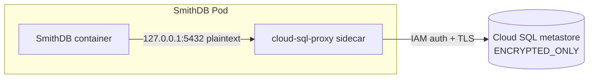

# SmithDB on GCP

This module provides GCP reference infrastructure and Helm values for SmithDB.
SmithDB is optional and runs alongside ClickHouse in the LangSmith v16 release.

## What is provisioned

With `enable_smithdb = true`, the infrastructure pass creates:

- a dedicated PostgreSQL 18 Cloud SQL metastore on a private IP, or wiring for
  dedicated BYO Postgres (including AlloyDB);
- a dedicated GCS object-store bucket with uniform bucket-level access and
  public access prevention;
- a dedicated GCP service account bound to the chart's SmithDB Kubernetes
  service account through Workload Identity, holding `roles/storage.objectAdmin`
  scoped to that one bucket;
- two GKE node pools - a Local SSD-backed pool for the cache-heavy workloads and
  a compute pool for the support workloads - both autoscaling from zero;
- the `smithdb-metastore` and `smithdb-taskdb` Kubernetes Secrets.

Object-store traffic stays on Google's network: the subnet has Private Google
Access enabled, so pods on private nodes reach `storage.googleapis.com` without
egressing through Cloud NAT.

SmithDB requires GKE Standard. Autopilot cannot run the dedicated Local SSD node
pools, and `enable_smithdb = true` with `gke_use_autopilot = true` fails at plan
time.

## Configure infrastructure

Set `enable_smithdb = true` in `infra/terraform.tfvars`. Managed resources are
the default. For BYO Postgres:

```hcl
smithdb_metastore_source            = "external"
smithdb_external_metastore_host     = "10.20.0.5"
smithdb_external_metastore_username = "smithdb"
```

Supply `TF_VAR_smithdb_external_metastore_password` outside the tfvars file. The
Postgres database and the GCS bucket must both be dedicated to SmithDB - do not
point them at the LangSmith application database or blob-storage bucket.

## Metastore TLS on GCP

### Why a direct TLS connection fails

SmithDB 0.16 cannot verify a Cloud SQL certificate. Point it straight at an
`ENCRYPTED_ONLY` instance with `smithdb_metastore_use_ssl = true` and the query,
ingestion, and compaction pods crashloop on
`InvalidCertificate(UnknownIssuer)`.

Cloud SQL presents a per-instance self-signed CA and the services verify the
chain against the public trust store, so validation cannot succeed. The service
config exposes a single `use_ssl` boolean with no CA path and no
encrypt-without-verify mode, and injecting the CA would not help either: the
server certificate carries no IP SAN while SmithDB connects to the private IP,
so verification would fail on the hostname instead.

The metastore migration hook is the one component unaffected, because it
connects through libpq with `sslmode=require`, which encrypts without verifying.
Expect the hook to succeed while every service fails against the same database.
That asymmetry is diagnostic, not a sign the database is misconfigured.

Two modes work around this. Both keep the instance itself at
`ssl_mode = "ENCRYPTED_ONLY"` or better.

### Mode 1: Cloud SQL Auth Proxy sidecar (production)

```hcl
smithdb_metastore_use_auth_proxy = true
smithdb_metastore_use_ssl        = false
# Optional; defaults to a pinned tag.
smithdb_auth_proxy_image         = "gcr.io/cloud-sql-connectors/cloud-sql-proxy:2.25.0"
```

A Cloud SQL Auth Proxy sidecar runs in every SmithDB Pod. It authenticates to
the Cloud SQL Admin API as the pod's Workload Identity principal, holds the TLS
session to the instance, and serves plaintext on the Pod loopback. SmithDB
connects to `127.0.0.1`, which is why `smithdb_metastore_use_ssl` must be
`false` - the hop the proxy secures is the one leaving the Pod, and a TLS
handshake against the loopback has no server to meet. Terraform rejects the two
set together rather than letting it fail at connect time.



Terraform does the rest: it grants the SmithDB service account
`roles/cloudsql.client`, writes `127.0.0.1` into the `smithdb-metastore` secret's
host key, and exposes the instance connection name.  `init-values.sh` reads
those outputs and generates the sidecar into
`langsmith-values-smithdb-overrides.yaml`. Nothing here needs hand-editing.

The generated args include `--private-ip`, which is not optional here. The Cloud
SQL Auth Proxy dials the instance's public IP by default, and this module creates
the metastore with `ipv4_enabled = false`, so without the flag the proxy starts
cleanly, passes its health checks, accepts the loopback connection and only then
fails the outbound dial with `instance does not have IP of type "PUBLIC"`. The
SmithDB container sees a connection reset rather than a proxy that refused to
start, which points the investigation at the wrong container. Note the asymmetry
if you are comparing against the AlloyDB path below: `alloydb-auth-proxy`
defaults to private IP and needs a flag for the public or PSC cases instead.

The sidecar is emitted under `smithdb.commonInitContainers`, not under the
per-component `smithdb.<service>.deployment.sidecars`. That distinction matters:
`deployment.sidecars` exists, but the chart only wires it into the SmithDB
Deployments, and the `metastore-migration` pre-install hook Job is not a
Deployment. The hook runs before any Deployment exists, so a per-Deployment
sidecar leaves the one component that must reach the metastore first with no
proxy to connect through. `commonInitContainers` is injected into every SmithDB
Deployment and both Jobs, the hook included.

The container carries `restartPolicy: Always`, which makes it a native sidecar
rather than an init container. In the hook Job that is what allows completion:
the kubelet stops a native sidecar once the Job's main container exits, whereas
a plain init container would block the Job from ever starting its work and a
non-native sidecar would hold the Job Running forever.

Requires `smithdb_metastore_source = "create"`. The proxy takes the instance
connection name as its only positional argument, and that is knowable only for
an instance this module created. For an external instance, see below.

### Mode 2: relaxed instance, no TLS (test and staging)

```hcl
smithdb_metastore_ssl_mode = "ALLOW_UNENCRYPTED_AND_ENCRYPTED"
smithdb_metastore_use_ssl  = false
```

Traffic stays on a private IP inside the VPC and never leaves it, which is
acceptable for a test or staging stack. It is not a production posture: the
metastore hop is unencrypted, and the instance accepts unencrypted connections
from anything else that reaches it on the VPC. Prefer mode 1 anywhere the data
matters.

Revisit both once SmithDB accepts a CA bundle or a non-verifying SSL mode, at
which point TLS can go back on directly and the sidecar becomes optional.

### AlloyDB

AlloyDB is documented, not provisioned - this module creates Cloud SQL. Route it
through the external metastore path and configure its proxy in the Helm values
by hand:

```hcl
smithdb_metastore_source            = "external"
smithdb_external_metastore_host     = "127.0.0.1"
smithdb_external_metastore_database = "smithdb"
smithdb_external_metastore_username = "smithdb"
smithdb_metastore_use_ssl           = false
```

Then add the sidecar to `helm/values/langsmith-values-smithdb.yaml`, which
`init-values.sh` copies once and leaves alone thereafter. The shape is identical
to the Cloud SQL one, with the AlloyDB image and its fully qualified instance
path as the positional argument:

```yaml
smithdb:
  commonInitContainers:
    - name: alloydb-auth-proxy
      image: gcr.io/alloydb-connectors/alloydb-auth-proxy:1.15.2
      restartPolicy: Always
      args:
        - "--address=127.0.0.1"
        - "--port=5432"
        - "--structured-logs"
        - "--health-check"
        - "--http-address=0.0.0.0"
        - "--http-port=9090"
        # Add --auto-iam-authn for AlloyDB IAM database authentication,
        # and --psc or --public-ip when not on the default private IP path.
        - "projects/PROJECT/locations/REGION/clusters/CLUSTER/instances/INSTANCE"
```

The chart ships this as `examples/smithdb_alloydb_auth_proxy.yaml`, including
the probes and security context worth copying with it. The AlloyDB service
account needs `roles/alloydb.client` rather than `roles/cloudsql.client`, and
because the instance is external, Terraform grants neither - do it alongside
whatever provisions the cluster.

## Deploy SmithDB services

Apply infrastructure, then generate values:

```sh
make init-values
```

Then deploy:

```sh
make deploy
```

SmithDB needs chart 0.16 or newer. `deploy.sh` already pins the 0.16 line and
refuses anything off it, so there is nothing SmithDB-specific to set. To name an
exact patch rather than the latest on the line, pass `CHART_VERSION=0.16.3`.

The historical backfill needs 0.16.6 or newer, which is where the migration Job
started following `config.blobStorage.engine` for its source blob store.
`deploy.sh` rejects an earlier patch when `smithdb_migration_enabled` is true. The
other two gates work on any patch of the line. Check what is published with:

```sh
helm search repo langchain/langsmith --versions
```

## Staged rollout

The generated values deploy the SmithDB services with every LangSmith
integration gate disabled:

```yaml
smithdb:
  langsmith:
    ingestion:
      enabled: false
    migration:
      enabled: false
    query:
      enabled: false
```

Set `smithdb_ingestion_enabled`, `smithdb_migration_enabled`, and
`smithdb_query_enabled` in `infra/terraform.tfvars`. Terraform enforces that
migration and query each require ingestion.
Apply and validate each stage separately, and keep ClickHouse enabled throughout
LangSmith v16.

1) All gates off. The services come up and the metastore migration Job runs.
Confirm the pods schedule onto the expected pools and can reach both Postgres
and the bucket before going further.

2) `smithdb_ingestion_enabled = true`. LangSmith writes traces to SmithDB as
well as ClickHouse. Reads still come from ClickHouse.

3) `smithdb_migration_enabled = true`, if you need historical data. This renders
the migration Job plus an in-chart taskdb Postgres StatefulSet for migration task
state, and is the most node-hungry gate of the three.

The Job requests 8 CPU, 16Gi, and 100Gi of ephemeral storage, so the values overlay
pins it to the Local SSD pool; a core node can satisfy neither the CPU nor the
ephemeral storage. Since the three cache workloads already request 12 of an
n2-standard-16's ~15.9 allocatable CPU, the autoscaler adds a second Local SSD node
for the Job, so keep `smithdb_instance_store_max_nodes` at 2 or more while this gate
is on.

The taskdb StatefulSet requests 2 CPU and 4Gi as of chart 0.16.0-rc.26 (earlier
release candidates left it unconstrained) and is not pinned, so it lands on the core
pool and may push that pool to scale up too. Check `gke_max_nodes` has room before
enabling this gate.

The separate `metastore-migration` Helm hook stays unpinned on the core pool by
design - it runs before any SmithDB pod exists, so nothing would trigger a scale-up
from zero.

The backfill also reads outside its own bucket, which is covered under
"Backfill access to the traces bucket" below.

4) `smithdb_query_enabled = true`. Reads move to SmithDB.

Follow the installation guide provided by LangChain for the validation steps at
each stage.

## Verification

```sh
kubectl get pods -n langsmith -l app.kubernetes.io/instance=langsmith -o wide
kubectl get nodes -L smithdb-local/instance-store,smithdb-local/compute

# The cache mount must be on Local SSD, not the boot disk.
kubectl exec -n langsmith deploy/langsmith-smithdb-query -- df -h /data

# Once ingestion is on, segments should start landing in the bucket.
gcloud storage ls "gs://$(terraform -chdir=infra output -raw smithdb_object_store_bucket)/**"
```

Local SSD only backs the cache because the node pool uses GKE's Local SSD-backed
*ephemeral storage* mode. With raw block Local SSD the `emptyDir` would silently
fall back to the boot disk and cache I/O would be slow, which is why the `df -h`
check matters.

Segments land at the bucket root under `<tenant-id>/<session-id>/`. There is no
`smithdb/` prefix, even though the chart sets a `ROOT_FOLDER` of `smithdb` on the
GCS object store, so list the whole bucket rather than a prefix.

## Backfill access to the traces bucket

The historical backfill is the one SmithDB workload that reads outside its own
bucket. LangSmith offloads large run payloads - inputs, outputs and errors - to
the traces bucket and keeps only a key in ClickHouse, so the backfill has to
fetch those objects to rewrite them into `.vortex` segments.

Two pieces make that work, and they sit on opposite sides of the boundary:

1) The chart selects the provider. From chart 0.16.6 the migration Job follows
`config.blobStorage.engine`, so a GCS engine renders
`SMITHDB_MIGRATION__BLOB_STORE_DEFAULT__TYPE: gcs` with a bucket and a root
folder and no credential fields at all. The Job then authenticates as the Pod's
Workload Identity principal. Nothing is needed in the values files for this.

2) Terraform grants the access. `modules/smithdb` holds
`roles/storage.objectViewer` for the SmithDB service account on the traces
bucket. Read-only, bucket-scoped, and created only with the migration gate, so a
steady-state install keeps a service account that can reach nothing but its own
bucket. Helm cannot create a GCP IAM binding, so the chart behaviour alone is not
sufficient - the grant has to live here.

Chart 0.16.5 and earlier asked for the `s3` provider whatever the engine said,
and wired the credentials to `blob_storage_access_key` and
`blob_storage_secret_access_key`. On GCP those two are empty by design, so the
backfill AWS4-signed every read with an empty secret and `storage.googleapis.com`
answered `403 SignatureDoesNotMatch`. `deploy.sh` refuses to deploy a patch below
0.16.6 while `smithdb_migration_enabled` is true, rather than let that resurface.

Either way, a failure here is easy to misread. The Job reports `Running`, the pod
stays `2/2 Running`, the metastore and the Auth Proxy are both healthy, and the
only symptom is that planned-row progress never leaves 0%. Check the task state
rather than the pod phase:

```sh
POD=$(kubectl get pod -n langsmith -l job-name=langsmith-smithdb-migration \
  -o jsonpath='{.items[0].metadata.name}')

kubectl exec -n langsmith "$POD" -c migration -- \
  ./smithdb migrate --self-hosted diagnose status
kubectl exec -n langsmith "$POD" -c migration -- \
  ./smithdb migrate --self-hosted diagnose failures
```

Failures are recorded as non-retryable, so they survive a Job restart. After
fixing access, reset them or the tasks stay failed:

```sh
kubectl exec -n langsmith "$POD" -c migration -- \
  ./smithdb migrate --self-hosted diagnose retry-failed --all --yes
```

Do not solve this with a GCS HMAC key. It works, but it puts a long-lived static
credential into Terraform state and into a Kubernetes Secret, for a bucket the
pod can already reach through its own identity.

A task whose window covers the last hour or so stays `pending` rather than being
claimed. That is the worker pool's recent-runs safety delay, not a fault.

## Upgrading with the backfill Job in place

A Job's `spec.template` is immutable, and the backfill Job is a plain resource
rather than a Helm hook, so nothing recreates it. Once it exists, any change to
its pod template fails the upgrade - a chart bump moving the Auth Proxy image, a
values change here, a different metastore secret. The API server rejects the
apply and Helm prints the entire PodSpec on one line, ending in `field is
immutable`. That message names neither the Job nor the remedy.

`deploy.sh` compares the rendered template with the live one and stops first,
naming what changed. Clear it by deleting the Job, then deploy again:

```sh
kubectl delete job langsmith-smithdb-migration -n langsmith \
  --cascade=foreground --wait=true
```

Deleting the Job is not the same as losing the backfill. Task state lives in the
taskdb StatefulSet, which the chart keeps, so a fresh Job re-plans and resumes.
`--cascade=foreground` matters on a tight namespace quota: the old 8-CPU pod has
to be gone before the new one can be admitted. The delete is left to the operator
rather than done automatically, because it terminates a backfill that may be
mid-flight.

## Namespace quota headroom

`modules/k8s-bootstrap` puts a `ResourceQuota` on the LangSmith namespace, and
SmithDB does not fit inside the base figures. The root adds headroom
automatically from `enable_smithdb` and `smithdb_migration_enabled`, so there is
nothing to set by hand:

| Configuration | requests.cpu | requests.memory | pods |
| --- | --- | --- | --- |
| LangSmith only | 50 | 120Gi | 100 |
| SmithDB services | 70 | 158Gi | 112 |
| SmithDB plus backfill | 79 | 176Gi | 120 |

The headroom covers steady-state SmithDB (14.25 CPU / 28.25Gi across five
Deployments), one Auth Proxy sidecar per pod, a rolling-update surge allowance
for one extra copy of the largest pod, and the backfill Job's 8 CPU / 16Gi.

The surge allowance matters more than it looks. Without it an upgrade wedges
rather than failing: the replacement pod is refused on quota, so the old pod
never terminates, and Helm waits on a rollout that cannot progress. Neither the
`FailedCreate` event on the ReplicaSet nor the Job that reports `Running` with no
pod names SmithDB or the quota as the cause.

To check headroom on a live cluster:

```sh
kubectl get resourcequota langsmith-quota -n langsmith
kubectl describe resourcequota langsmith-quota -n langsmith
```

If the extra room is not wanted - a shared cluster with its own governance, for
example - `resource_quota_extra_cpu`, `resource_quota_extra_memory_gi` and
`resource_quota_extra_pods` on `modules/k8s-bootstrap` accept explicit figures.
Both are bounded: a namespace quota is a guardrail against a runaway HPA, so it
is not meant to be raised until every pod fits.

## Sizing

At chart defaults the three cache workloads request 4 CPU each and 200Gi
(query) + 100Gi (ingestion) + 100Gi (compactionWorker) of ephemeral storage.
That is 12 CPU against the ~15.9 allocatable vCPU of an `n2-standard-16`, and
roughly 430 GB allocatable ephemeral storage, which the default 2 Local SSDs
(750 GB raw) cover with headroom. If you override the resource requests upward
in `helm/values/langsmith-values-smithdb.yaml`, raise
`smithdb_instance_store_local_ssd_count` to match, or replicas will sit Pending.

The count is not free-form. Compute Engine accepts only specific Local SSD
counts per machine type: for N2 at 12-20 vCPU, including the default
`n2-standard-16`, the legal set is 2, 4, 8, 16 or 24. A value in between, such
as 3, is rejected when the node pool is created - after the plan has passed, so
it surfaces as an apply failure rather than a validation error. Terraform
validates the variable against that set up front to keep the failure at plan
time.

## Provisioning node pools outside this module

`enable_smithdb` creates both pools against the cluster this module manages, so
nothing below is needed on that path. The snippets are the portable form of what
the module builds, for running SmithDB on a GKE cluster provisioned elsewhere.
Whatever creates the pools, they have to carry the labels and taints the
generated Helm values select on, or the SmithDB pods sit Pending with no node to
match.

Cache pool. `ephemeral_storage_local_ssd_config` is the part that matters:

```hcl
resource "google_container_node_pool" "smithdb_instance_store" {
  name     = "smithdb-lssd"
  project  = var.project_id
  location = var.region
  cluster  = var.cluster_name

  autoscaling {
    min_node_count = 0
    max_node_count = 3
  }

  node_config {
    machine_type = "n2-standard-16"
    disk_size_gb = 100
    disk_type    = "pd-balanced"
    image_type   = "COS_CONTAINERD"

    # 2, 4, 8, 16 or 24 for N2 at 12-20 vCPU. Not 3.
    ephemeral_storage_local_ssd_config {
      local_ssd_count = 2
    }

    # Required, or the SmithDB pods cannot assume their GCP service account.
    workload_metadata_config {
      mode = "GKE_METADATA"
    }

    labels = {
      "smithdb-local/instance-store" = "true"
    }

    taint {
      key    = "smithdb-local/instance-store"
      value  = "true"
      effect = "NO_SCHEDULE"
    }
  }
}
```

Compute pool, for `compaction` and `clusterManager`. Same shape with no Local
SSD, `smithdb-local/compute` in place of `smithdb-local/instance-store`, and a
smaller machine type such as `n2-standard-8`.

The equivalent as a one-liner, useful for adding a pool to an existing cluster:

```sh
gcloud container node-pools create smithdb-lssd \
  --cluster CLUSTER --region REGION --project PROJECT \
  --machine-type n2-standard-16 \
  --ephemeral-storage-local-ssd count=2 \
  --enable-autoscaling --num-nodes 0 --min-nodes 0 --max-nodes 3 \
  --workload-metadata=GKE_METADATA \
  --node-labels smithdb-local/instance-store=true \
  --node-taints smithdb-local/instance-store=true:NoSchedule
```

Two things are easy to get wrong here, and both fail quietly rather than loudly:

1) Use the *ephemeral storage* Local SSD mode, not raw block
(`--local-nvme-ssd-block` / `local_nvme_ssd_block_config`). Only the ephemeral
storage mode combines the disks into the filesystem kubelet uses, which is what
makes the capacity appear as node-allocatable `ephemeral-storage` and back
`emptyDir`. With raw block the pods still schedule, but SmithDB's cache lands on
the boot disk and everything is merely slow. `kubectl exec ... -- df -h /data`
is how you tell the difference.

2) `local_ssd_count` must be a member of the machine family's fixed set. It is
validated at node pool creation, not at plan time, so an illegal count fails
partway through an apply.

Both pools can sit at zero when SmithDB is off; the taints keep other workloads
away and the autoscaler brings them up when tolerating pods appear.

On Autopilot there are no node pools to create, which is why `enable_smithdb`
rejects `gke_use_autopilot` at plan time. Running SmithDB there means replacing
the overlay's nodeSelector with Autopilot's own
`cloud.google.com/gke-ephemeral-storage-local-ssd` selector and letting Google
size the nodes. That path is untested here.

## Production notes

- Keep Cloud SQL deletion protection and backups enabled.
- Keep `smithdb_bucket_force_destroy = false`.
- Set `smithdb_bucket_kms_key` to use CMEK. The module grants the Cloud Storage
  service agent `roles/cloudkms.cryptoKeyEncrypterDecrypter` on that key; if the
  key lives in another project, that project's IAM policy must allow the grant.
- Do not place object-store credentials in Helm values. Pods authenticate
  through Workload Identity, and the chart's GCS path has no credential fields.
- The metastore and taskdb passwords are generated by Terraform and only ever
  written into Kubernetes Secrets. They are deliberately not root outputs.
